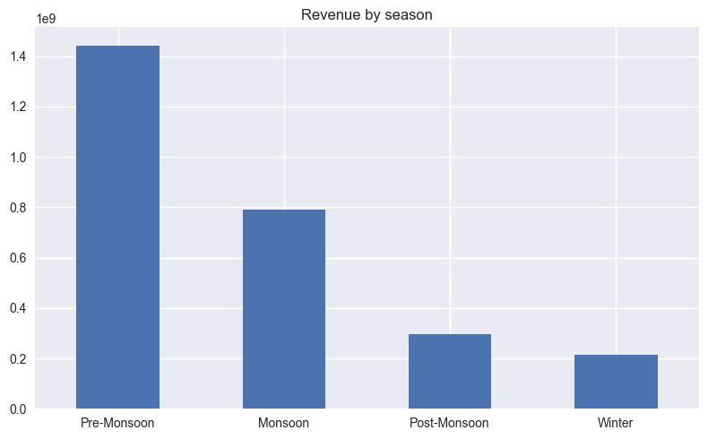
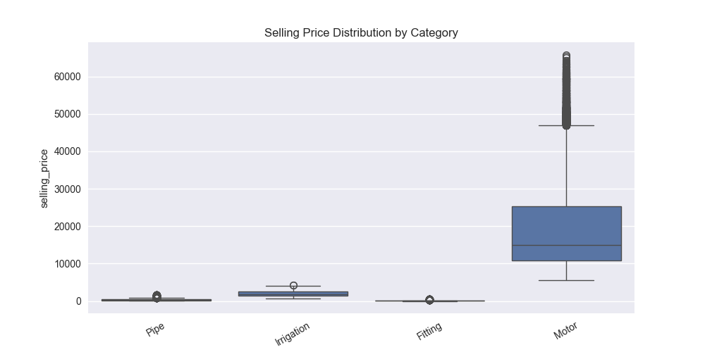
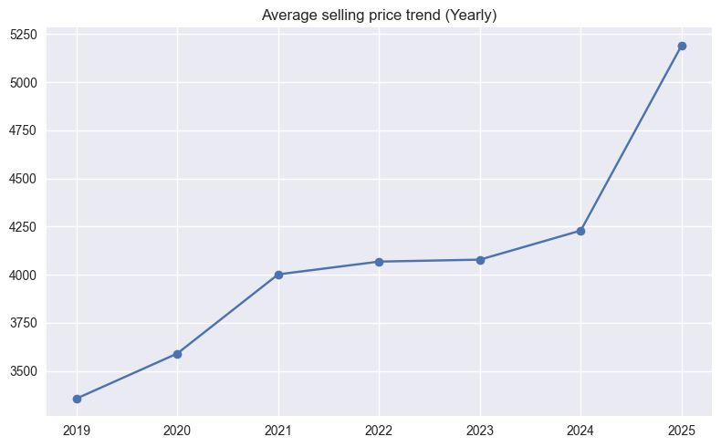

# Exploratory Data Analysis (EDA)

## Weekly Revenue Trend
This chart shows overall revenue movement and seasonality.

---

## Price vs Units Sold
A clear inverse relationship validates elasticity modeling.

---

## Discount Impact
Discounts show diminishing returns at higher levels.

