# Exploratory Data Analysis (EDA)

## Average price trend
This chart shows overall price trend over years.

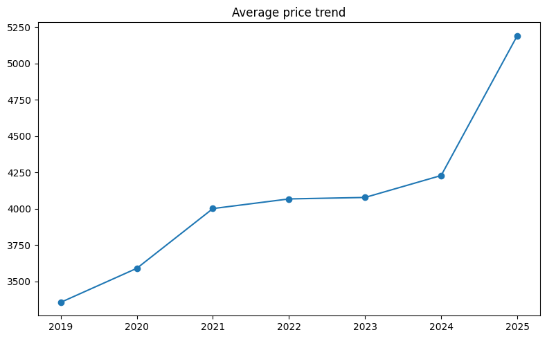

---

## Customer revenue share
This chart will show the revenue distribution among the customers.

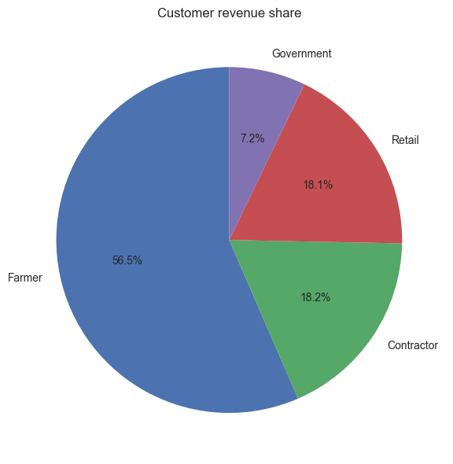

---

## Customer transaction share
This chart will show the transactions distribution among the customers.

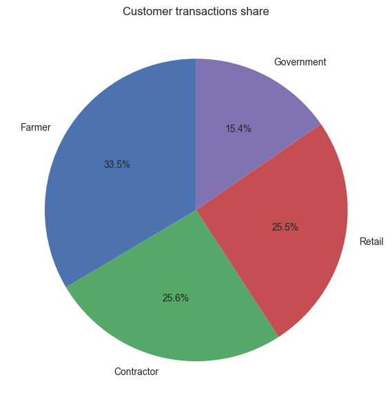

---

## External price shocks
A clear showcase of the price shocks throughout the time.

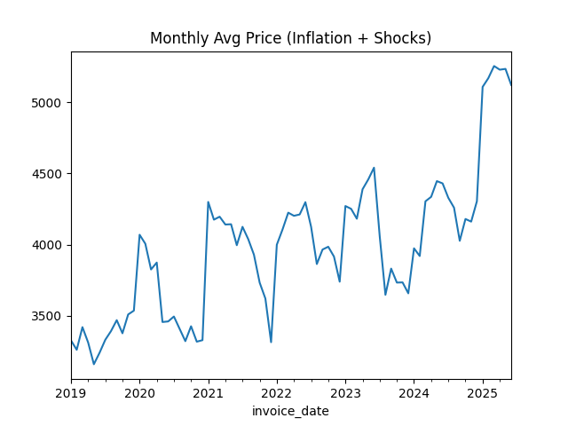

---

## High price low volume check
Items with higher prices but lower volumes check.

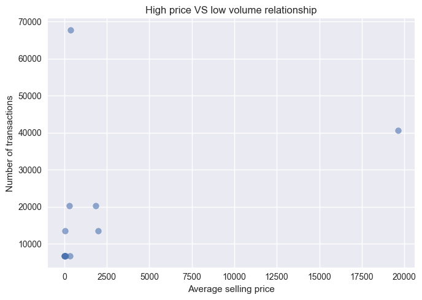

---

## Monthly seasonality
Showcasing the monthly transactions.

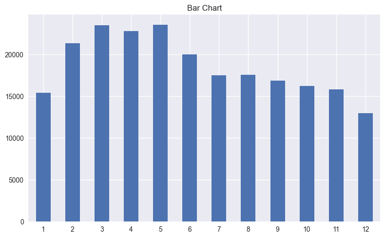

---

## Motor revenue analysis
This chart will show the revenue generated by motor throughout the months.

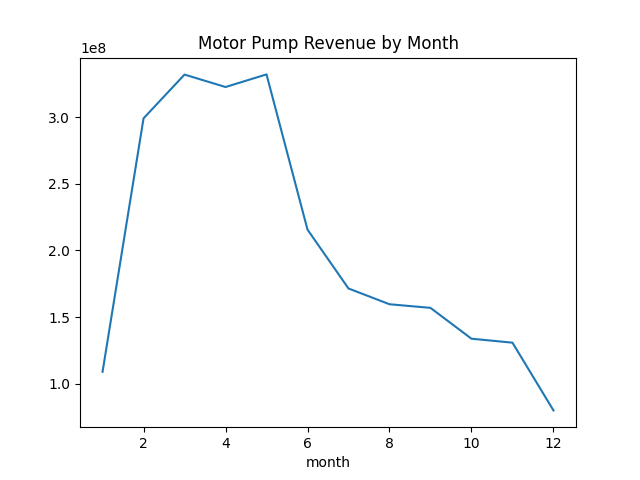

---

## Price distribution by category
This chart will show the price distribution by category.

---

## Product transaction distribution
This chart will show the transaction distribution for top 5 products.

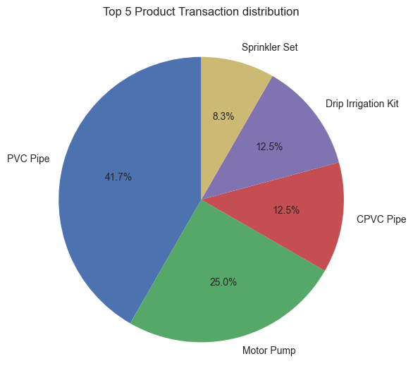

---

## Category revenue share
The revenue share of each category.

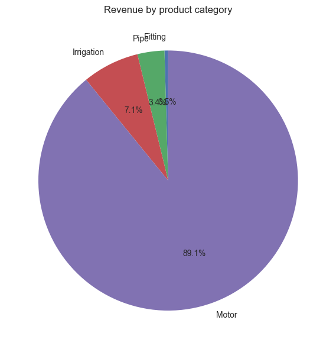

---

## Revenue change by season
Revenue change with change in the season.

---

## Revenue VS avg_Price
Relationship between the revenue generated and average price of an item.

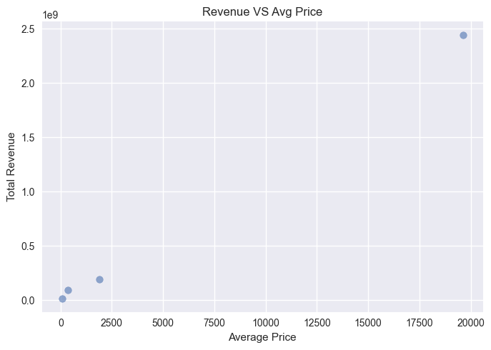

---

## Selling_price VS Cost_price
Showcasing the relation between the selling price vs cost price.

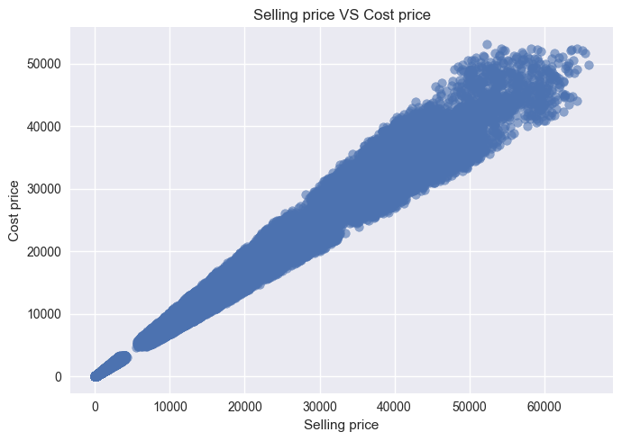

---

## Top revenue generators
Products generating maximum revenue.

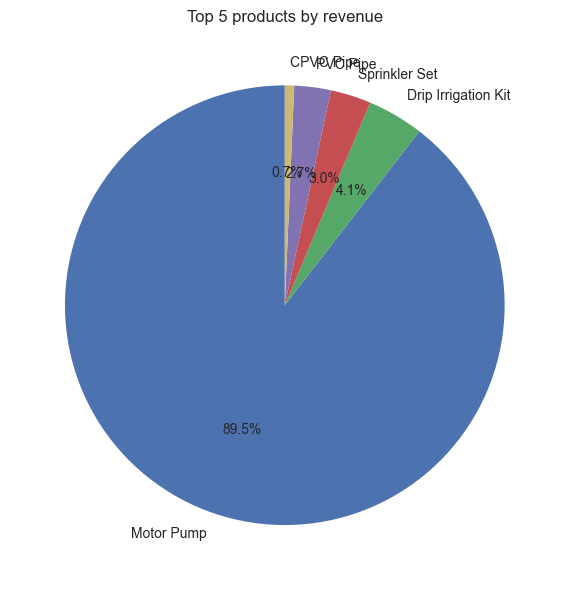

---

## Yearly transactions
Showcasing year on year change in the transactions

---

## Covid period impact
A clear showcase of impact of covid period on the revenue.

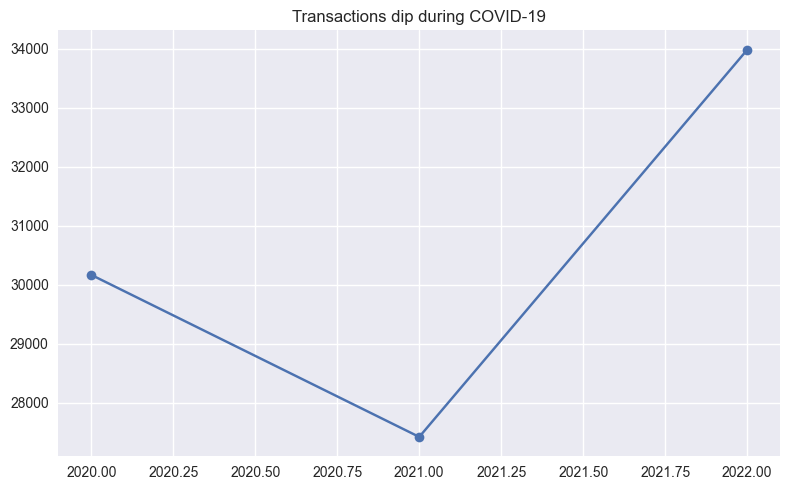

---

